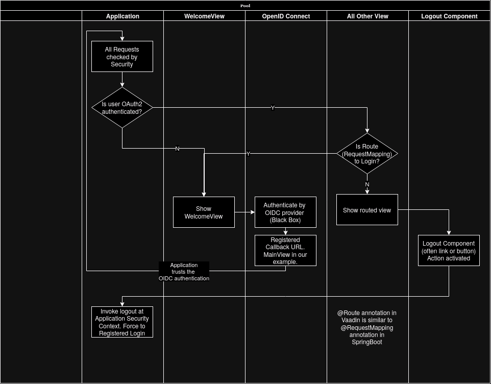

# Project Creation
Initialize Project at https://start.spring.io/ with:
- Language: Java 17 with Spring Boot: 3.2.4
- Packaging: Jar and Project: maven  (war packaging and gradle project also good)
- Dependencies
  1. OAuth2 Client
  2. Vaadin
- Dependencies to be added later
  1. H2 Database
  2. JDBC API
- I use VScode but other IDE like Eclipse works perfectly

# Authentication by OAuth2
Default Authentication is boring and does nothing. The project needs an OIDC (OpenID Connect) provider for OAuth2 client even the development only.

## Get an OIDC playground
Any OIDC provider is good but it must allows *callback to localhost*. OIDC playground service could be:
- https://openidconnect.net/ (This example)
- https://developers.google.com/identity/openid-connect/openid-connect
- Setup localhost OIDC: https://github.com/appvia/mock-oidc-user-server or https://www.keycloak.org/

Set the allowed callback URL (which is 'redirect_uri') at the OIDC provider (change your port number if needed):
```
http://localhost:8080/login/oauth2/code/my-oidc-client
```
Append the text below into ```application.properties``` for the my OIDC provider:
```
spring.security.oauth2.client.provider.my-oidc.issuer-uri: https://dev-2cbf33l86hcdfi7d.us.auth0.com/
spring.security.oauth2.client.registration.my-oidc-client.provider: my-oidc
spring.security.oauth2.client.registration.my-oidc-client.client-id: FvVEVGHAEMqwfTGCxFuCQdsTIx5Ahamd
spring.security.oauth2.client.registration.my-oidc-client.client-secret: X4r-Ox-q-nEVcQqzIRFixPaHqEGShtqEWA_nY_xdSiADoOdTEefiLoF7BpDWdnb8
spring.security.oauth2.client.registration.my-oidc-client.authorization-grant-type: authorization_code
spring.security.oauth2.client.registration.my-oidc-client.scope: openid,profile,email
```
Change ```client-id```, ```client-secret``` and ```issuer-uri``` for different OIDC provider. **Do not disclose these information for any serious project**. I disclose them only because that is just a playground.

## Add SecurityConfig to demand authentication except login url
This Security Configuration is made for Vaddin. Springboot Project without Vaadin should configure its own SecurityFilterChain.
```
@Configuration
@EnableWebSecurity
public class SecurityConfig extends VaadinWebSecurity {
    private static final String LOGIN_URL = "/login";
    @Override
    public void configure(HttpSecurity http) throws Exception {
        super.configure(http);
        http.oauth2Login(c -> c.loginPage(LOGIN_URL).permitAll());
    }
}
```
Access to everything except LOGIN_URL will requires oauth2 authentication. Logout will be handled later.

## Add Views and User Session Beans
A minimalist authenication project needs these:
- ```User.java```: User Bean focus on authenicated identity. User Bean can be expanded later for Authorization.
- ```UserSession.java```: User Session Bean which interact with ```SecurityContextHolder```. All models and business logic should not use this class except they deal with login and logout. These class should trust User Bean.
- ```MainView.java```: The first view users seen *after* authenicated. It shows user identity and it has a logout button.
- ```WelcomeView.java```: A introduction view for non-authenicated user or being logged out. Its ```@Route``` is ```login``` which is recognized by ```SecurityConfig```

These 4 classes are borrowed from [a Vaadin blog](https://vaadin.com/blog/oauth-2-and-google-sign-in-for-a-vaadin-application) with minor customization.

The logout button, which should be refactored as a shared component, worth a special mention:
```
Button logoutButton = new Button("Logout", click -> {
            UI.getCurrent().getPage().setLocation(LOGOUT_SUCCESS_URL); // which is "/"
            SecurityContextLogoutHandler logoutHandler = new SecurityContextLogoutHandler();
            logoutHandler.logout(
                    VaadinServletRequest.getCurrent().getHttpServletRequest(), null, null);
        });
```

Control Flow So Far


# Docker
TODO
